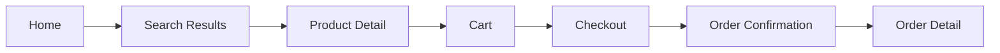
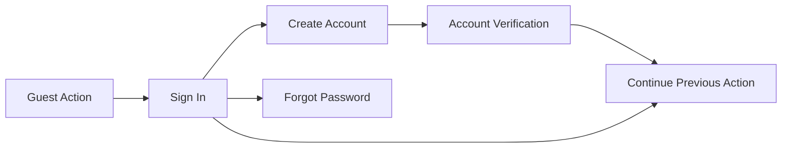
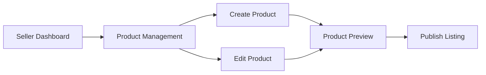
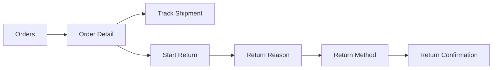

# Marketplace User Flows

This document defines the primary product flows for the Marketplace prototype.

## Shopper Purchase Flow

### Flow Notes

- Search must remain available from every shopping screen.
- Product cards should consistently expose image, title, rating, price, delivery signal, and primary action.
- Cart should allow quantity changes, item removal, saved-for-later, and checkout.
- Checkout should keep the order summary visible while the user edits shipping and payment.

## Authentication Flow

### Flow Notes

- Guest users can browse products without signing in.
- Sign in is required for checkout, orders, saved addresses, payments, and seller tools.
- After authentication, users should return to the action that triggered sign in.

## Seller Product Flow

### Flow Notes

- Seller tools should feel more operational than promotional.
- Product management should prioritize filtering, status, stock, price, and quick actions.
- Create product can use sections for basics, media, pricing, inventory, shipping, and review.

## Order And Return Flow

### Flow Notes

- Order detail should provide tracking, invoice, support, and return actions.
- Return flow should be clear, calm, and step-based.
- Each status should use direct copy, not vague labels.
